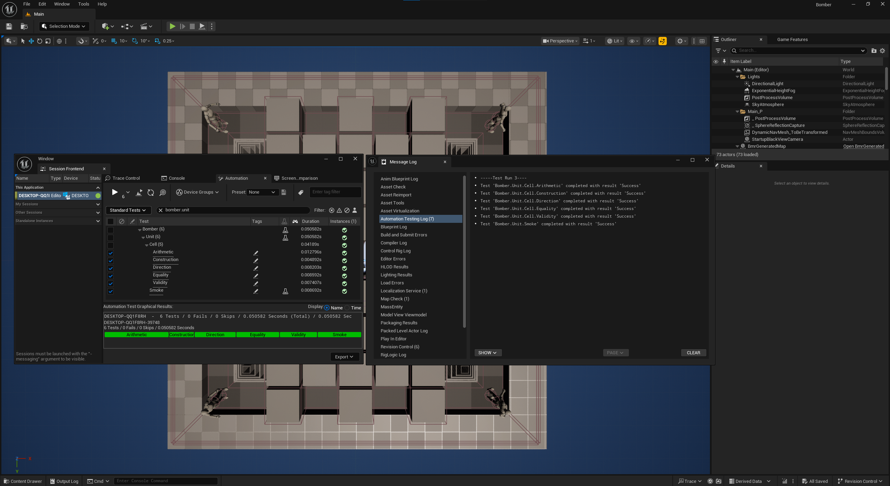
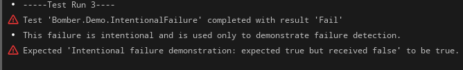

# 4주차 단위 테스트 결과 보고서

## 1. 테스트 개요

- 대상 프로젝트: Bomberrage
- QA 집중 범위: 폭탄 설치 및 폭발 피해 기능
- 테스트 단계: 단위 테스트
- 테스트 프레임워크: Unreal Automation Framework
- 실행 환경: Unreal Engine 5.7, Visual Studio 2022, Windows
- 최종 실행일: 2026-10-10

이번 주에는 폭탄 공격 기능의 기반이 되는 셀 좌표와 방향 변환 로직을 검증했다. 테스트 코드는 게임 실행 모듈과 분리된 에디터 전용 `BomberTests` 모듈에 구성했다.

## 2. 테스트 결과

| 테스트 경로 | 검증 내용 | 결과 |
| --- | --- | --- |
| `Bomber.Unit.Smoke` | 테스트 모듈 로드 및 실행 여부 | 성공 |
| `Bomber.Unit.Cell.Construction` | 좌표 생성 시 정수 단위 반올림 | 성공 |
| `Bomber.Unit.Cell.Validity` | 정상 셀과 `InvalidCell` 판별 | 성공 |
| `Bomber.Unit.Cell.Equality` | 동일·상이한 좌표 비교 | 성공 |
| `Bomber.Unit.Cell.Arithmetic` | 셀 덧셈·뺄셈·배율 연산 | 성공 |
| `Bomber.Unit.Cell.Direction` | 방향 enum과 셀의 양방향 변환 | 성공 |

최종 결과: **6개 성공 / 경고 0개 / 실패 0개**

## 3. 실패 감지 확인

자동화 환경이 실패를 정상적으로 감지하는지 확인하기 위해 항상 실패하도록 만든 임시 시연 테스트를 실행했다. Unreal Automation Framework가 해당 테스트를 `Fail`로 판정하고 예상값과 실제값을 로그에 기록하는 것을 확인했다.

이 시연 테스트는 증빙 화면을 만든 뒤 소스와 빌드 결과에서 제거했으며 저장소에는 포함하지 않았다. 제거 후 전체 테스트를 다시 빌드하고 실행해 정상 테스트 6개가 모두 성공하는 것을 확인했다.

## 4. 자동 실행 결과

명령줄에서 `Bomber.Unit` 그룹 전체를 실행해 HTML과 JSON 결과를 생성했다.

- 로컬 결과 위치: `Saved/Automation/Week4UnitFinal`
- 성공: 6
- 경고 포함 성공: 0
- 실패: 0

`Saved` 폴더의 실행 결과는 로컬 산출물이므로 Git에는 포함하지 않는다. 제출 시에는 이 보고서와 성공·실패 증빙 이미지를 사용한다.

## 5. 결론 및 다음 단계

4주차에는 테스트 모듈 구성, 셀 기반 핵심 로직 검증, 반복 실행, 실패 감지 확인까지 완료했다. 이 셀 로직은 폭탄의 위치와 폭발 방향·범위를 계산하는 기반이다.

5주차에는 다음 통합 테스트를 우선 진행한다.

1. 정상 셀과 점유 셀의 폭탄 설치 조건
2. 화력 수치에 따른 폭발 범위
3. 벽과 상자의 폭발 반응
4. 폭발 피해에 따른 플레이어 체력 감소
5. 여유가 있을 경우 연쇄 폭발

